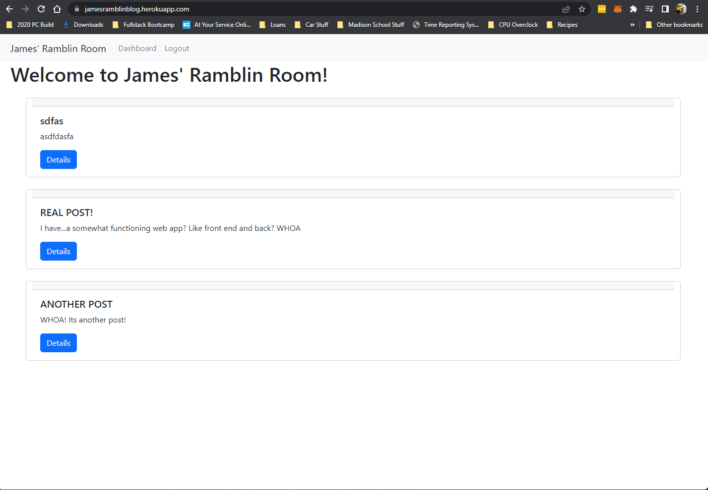

# James' Ramblin Room
  

  ## Table of Contents 
  - [Project Description](#Description)
  - [Installation](#Installation)
  - [Usage](#Usage)
  - [License](#License)
  - [Contribution](#Contribution)
  - [Tests](#Tests)
  - [Questions](#Questions)

  ## Description
  Welcome to James' Ramblin Room, a quaint little blog with simple but functional fullstack features allowing users to login or create an account, post to the blog page and even comment of exists blog posts. To see a photo of the live deployed app, look below: 

  

  ## Installation 
  To install the project, download all code via the included GitHUb link below. Once you have downloaded all files, enter your integrated terminal and run npm i to install all node dependencies. After these have been installed, your app is ready to use! OR, you could visit the like heroku link (also below) and access the blog without any setup required. 

  GitHub: https://github.com/JamesJPorter/Personnel-Manager

  Heroku: https://jamesramblinblog.herokuapp.com/ 

  ## Usage 
  To begin, you will arrive at the homepage of James Ramblin Room. Here you will see all pre-existing blog posts, as well as a nav bar at the top. You will want to create an account before doing anything else, as without this you will be unable to view comments on blog posts or leave comments of your own. 

  To create an account, click "Register" at the top of the page. From here, input your desired email and password. Once you have completed this, you will be taken back to the home page. You will not notice that each blog post has a newly labeled button, "Details". Click this to view all pre-existing comments on any post of your choosing as well as to leave a comment of your own! 

  ## License 
  Licensed udner the [MIT](https://opensource.org/licenses/MIT) license

  ## Contribution 
  N/A

  ## Tests 
  N/A

  ## Questions 
  ###porterjjames@gmail.com
  ###N/A